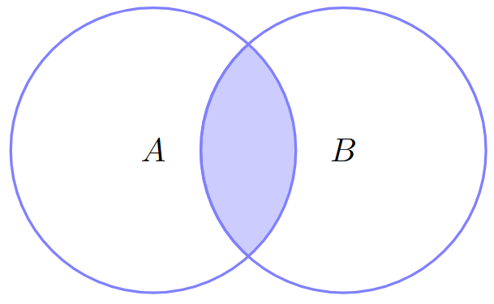
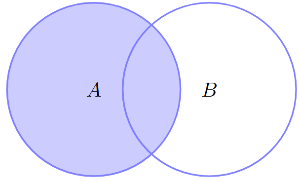
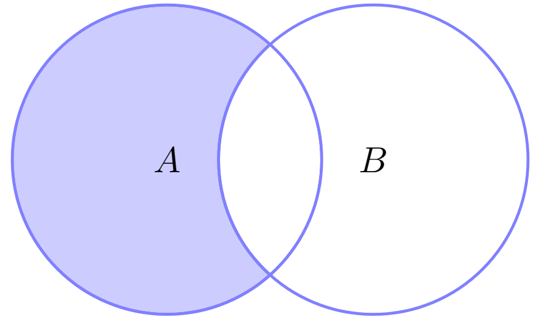
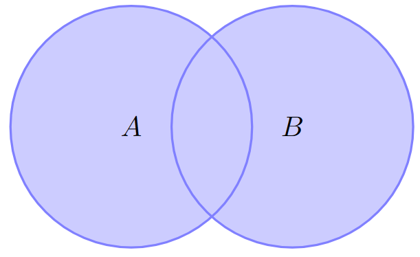
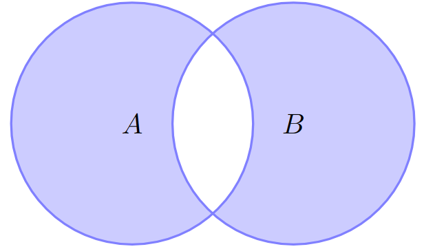

# Multi-table queries: SQL Joins

If we are given data in real life, most of the time it will be quite messy and without a very well defined structure at the beginning, and one of the main role of a data analyst is to be able to clean these information so we can extract useful insights from the dataset. In this cleaning process, there is the concept of _normalization_ which in few words consist into splitting a big database into subsets that can be related using joins.

Database normalization becomes useful because it minimizes duplicate data, and allows the data to grow independently, but as a trade-off, queries might get a little more complex since they need to find data across multiple tables.

## Primary and foreign keys

Tables that share information about an entity need to have a _primary key_ that identifies that entity uniquely across the database. This key can be of any data type (the only thing that matters is that is unique for each record in the table), but typically is set to be an auto incremental integer. A primary key is considered to be a _surrogate key_ if it is being artificially generated by the database (like the case of an auto incremental integer).

A primary key is a fundamental aspect when joining tables, because in order to perform a `JOIN` operation we must specify what is going to be the column which the relation will be set with.

> [!NOTE] Composite primary keys
> One thing to keep in mind is that a primary key does not necessarily consist of a single column, but it can be a combination of two or more. This is quite often when dealing with many-to-many relations, in which we create an auxiliary table that deals with a bidirectional one-to-many relation from the two tables, and its primary key consist of a combination of the two keys from both tables. In these cases we talk about a _composite primary key_

Now on the other side, a _foreign key_ is a column of a table that is referencing another column but from a different table (hence the foreign part) and is the missing part of the relation between two tables.

## Type of joins

SQL provides various types of joins that allow combining rows from two or more tables based on related columns. It’s important to keep in mind the fact that a join operation creates a new table, and with that newly created table more tables can be derived, this is why we say that joins allow combinations of two or more tables.

1. `INNER JOIN:` This one is by far the most popular. It only retrieves the matching rows between tables, which means that it will skip any `NULL` rows from both tables.
2. `LEFT JOIN:` Retrieves all rows from the leftmost table and matching rows from the right table, and if there is no match, it return the `NULL` rows **from the right table**
3. `RIGHT JOIN`: Does pretty much the same as a `LEFT JOIN` but it returns the `NULL` rows **from the left table**
4. `FULL JOIN`: Very similar to the `LEFT JOIN` and `RIGHT JOIN`, but this one returns `NULL` rows **from both tables**
5. `CROSS JOIN:` Returns the cartesian product of two tables (all possible combinations)
6. `SELF JOIN`: When a table is join to itself via an alias

Most of these joins can be seen in a set theory perspective. When we have two sets $A$ and $B$ we can talk about the union $A \cup B$ and intersection $A \cap B$. In the case of databases, we deal with tables rather than sets.

---

```sql
/* INNER JOIN */
SELECT *
FROM tableA
    INNER JOIN tableB ON tableA.id = tableB.id;
```

<div align="center">
	  
</div>

---

```sql
/* LEFT JOIN */
SELECT *
FROM tableA
    LEFT JOIN tableB ON tableA.id = tableB.id;
```

<div align="center">
	  
</div>

---

```sql
/* LEFT JOIN WITHOUT INNER */
SELECT *
FROM tableA
    LEFT JOIN tableB ON tableA.id = table.B
WHERE
    tableB.id IS NULL;
```

<div align="center">
	  
</div>

---

```sql
/* FULL JOIN */
SELECT *
FROM tableA
    FULL JOIN tableB ON tableA.id = tableB.id;
```

<div align="center">
	  
</div>

---

```sql
/* FULL JOIN WITHOUT INNER */
SELECT *
FROM tableA FULL
    JOIN tableB ON tableA.id = tableB.id
WHERE
    tableA.id IS NULL
    OR tableB.id IS NULL;
```

<div align="center">
	  
</div>

---
